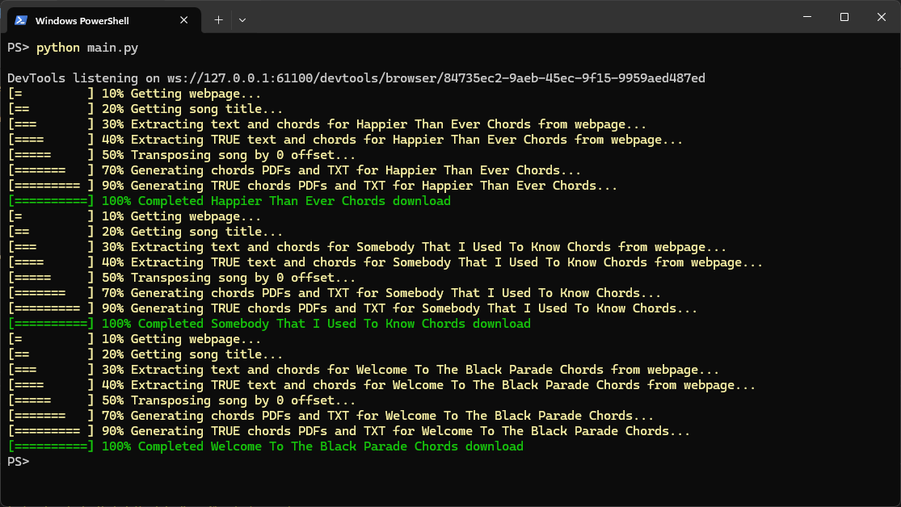
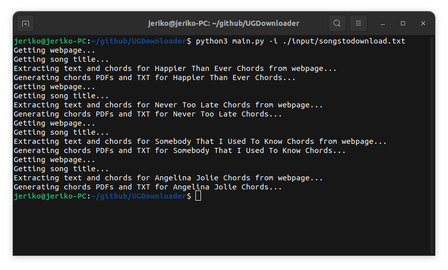
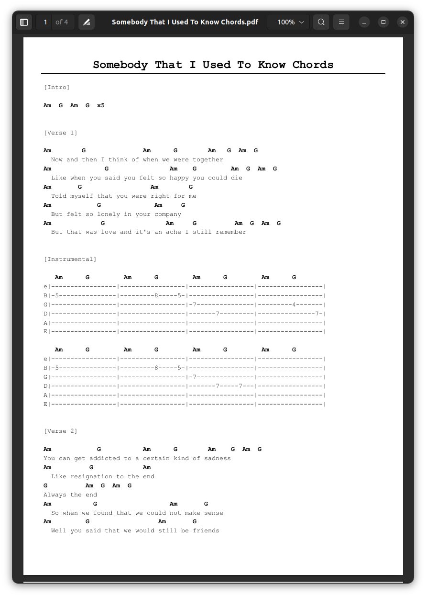
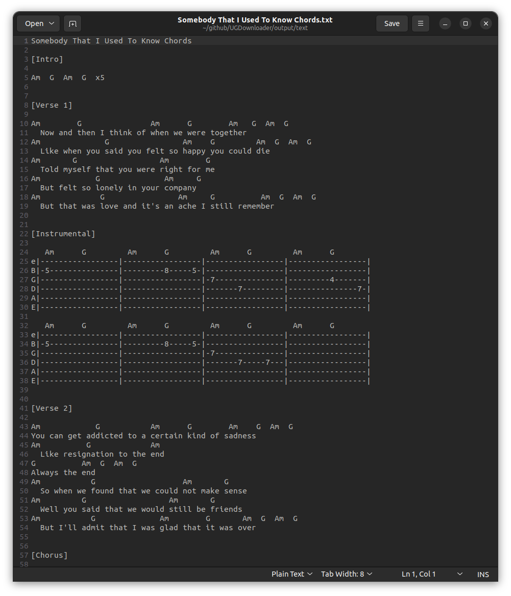
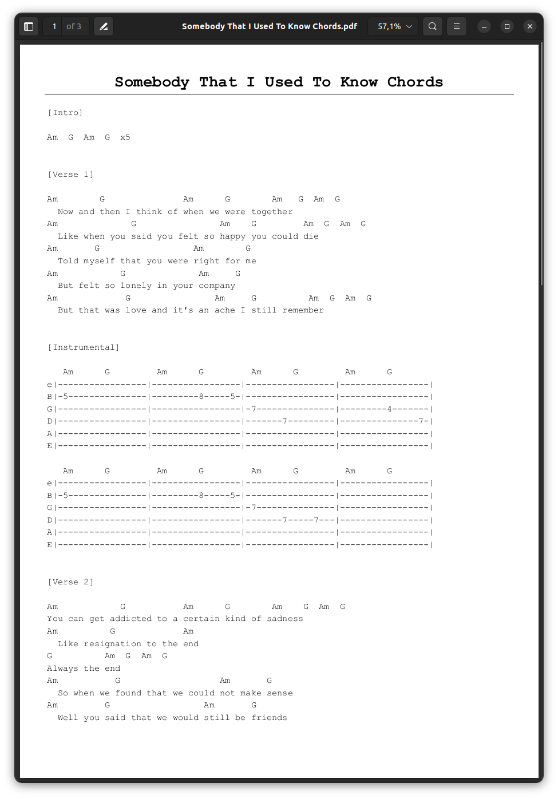
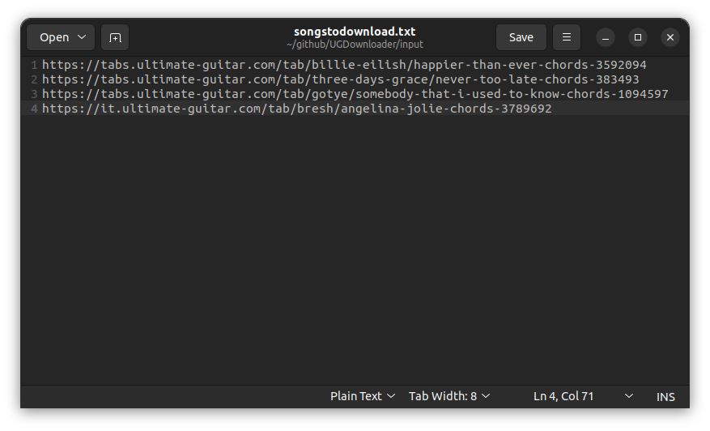
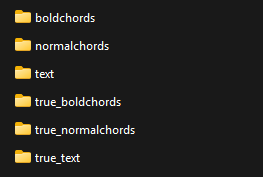

# 🎸⬇️ Simple-UGDownloader ⬇️🎸
Simple-UGDownloader is a simple downloader for UG Songs and PDF converter







### ⚙️ INSTALLATION ⚙️

```
pip3 install -r requirements.txt
```

AT LEAST one of the following webdrivers must be installed: Edge, Chrome, Firefox

### 💎 USAGE 💎

#### 🎶 BASIC USAGE 🎶

**INPUT**: "./input/songstodownload.txt" URL list will be used


Place yourself in the project directory

```
python3 main.py
```

OR you can specify your input file

```
python3 main.py --inputfile <INPUT_FILE>
```


The script will produce 6 outputs for each song in the output folders:
* TXT (text folder)
* PDF without bold chords (normalchords folder)
* PDF with bold chords (boldchords folder) (uses heuristics to determine chords and make them bold)
* TRUE PDF without bold chords (true_normalchords folder)
* TRUE PDF with bold chords (true_boldchords folder) (uses real website parsing to bold chords)
* TRUE TXT (true_text folder)




#### ➕🎵➖ CHORD TRANSPOSITION ➖🎵➕
You can pass a transposing offset (positive or negative)

At the moment, **transposing offset will be applied to all song listed in input file**

```
python3 main.py --transpose <POSITIVE_OR_NEGATIVE_OFFSET>
```

In this example we transpose down of 3 semitones
```
python3 main.py --transpose -3
```

#### 🎹 FORCE SHARPS (#) OR FLATS (b) 🎹

You can force a specific accidental between "#" and "b"

The default behaviour is:
* Not transposed songs will keep their original accidental (sharps will stay sharps, flats will stay flats)
* Transposed songs will use sharp by default

To change this behaviour you can force the use of "#" or "b" by passing a parameter ```--accidental <ACCIDENTAL>```

Example
```
python3 main.py --accidental "#"
python3 main.py --accidental "b"
```

#### 📄➡️📜 TXT TO PDF 📄➡️📜

You can input TXT of TRUE TXT to generate PDFs. This mode is useful if you want to adjust tabs that contain some errors after download.

You can choose between 2 modes:
* Normal mode: using ```--txt2pdf <TXT_FILE>```
* True mode: using ```--truetxt2pdf <TRUE_TXT_FILE>```

TRUE TXT uses ```\CHORD[<CHORD_HERE>]``` formatting to process text in a precise way, instead normal mode is based on heuristics

```
python3 main.py --txt2pdf <TXT_FILE>
python3 main.py --truetxt2pdf <TRUE_TXT_FILE>
```

**NOTE**: You can use transpostion in this mode adding the ```--transpose <TRANSPOSE_OFFSET>``` as argument

#### 🌎 USE ANOTHER WEBDRIVER 🌎

Default used webdriver: **Edge**

You can force the use of another webdriver passing the parameter ```--browser <BROWSER>```

Example if we want to use Chrome instead:
```
python3 main.py --browser "Chrome"
```

Available Browsers = Edge, Chrome, Firefox

### 🔮 NEXT STEPS 🔮
* [X] TXT To PDF converter (normal mode)
* [X] TXT to PDF converter (true mode)
* [X] Transposing (normal mode)
* [X] Transposing (true mode)
* [X] Add other webdrivers
* [X] Flat or Sharp preferences
* [ ] Apply different transposition in same execution
* [ ] GUI


