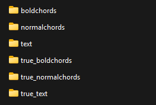

# Simple-UGDownloader
Simple-UGDownloader is a simple downloader for UG Songs


### INSTALLATION

```
pip3 install -r requirements.txt
```
Also Edge Webdriver must be installed: https://developer.microsoft.com/en-us/microsoft-edge/tools/webdriver?form=MA13LH

**NOTE**: If you are using Visual Studio Code, Edge driver is already installed

### USAGE

#### BASIC USAGE

**INPUT**: "./input/songstodownload.txt" URL list will be used


Place yourself in the project directory

```
python3 main.py
```

OR you can specify your input file

```
python3 main.py --inputfile <INPUT_FILE>
```


The script will produce 5 outputs for each song in the output folders:
* TXT (text folder)
* PDF without bold chords (normalchords folder)
* PDF with bold chords (boldchords folder) (uses heuristics to determine chords and make them bold)
* TRUE PDF with bold chords (true_boldchords folder) (uses real website parsing to bold chords)
* TRUE TXT (true_text folder)




#### CHORD TRANSPOSITION
You can pass a transposing offset (positive or negative)

At the moment, **transposing offset will be applied to all song listed in input file**

```
python3 main.py --transpose <POSITIVE_OR_NEGATIVE_OFFSET>
```

In this example we transpose down of 3 semitones
```
python3 main.py --transpose -3
```

#### TXT TO PDF

You can input TXT of TRUE TXT to generate PDFs. This mode is useful if you want to adjust tabs that contain some errors after download.

You can choose between 2 modes:
* Normal mode: using ```--txt2pdf <TXT_FILE>```
* True mode: using ```--truetxt2pdf <TRUE_TXT_FILE>```

TRUE TXT uses ```\CHORD[<CHORD_HERE>]``` formatting to process text in a precise way, instead normal mode is based on heuristics

```
python3 main.py --txt2pdf <TXT_FILE>
python3 main.py --truetxt2pdf <TRUE_TXT_FILE>
```

**NOTE**: You can use transpostion in this mode adding the ```--transpose <TRANSPOSE_OFFSET>``` as argument

### NEXT STEPS
* [X] TXT To PDF converter (normal mode)
* [X] TXT to PDF converter (true mode)
* [X] Transposing (normal mode)
* [X] Transposing (true mode)
* [ ] Flat or Sharp preferences
* [ ] GUI
* [ ] Add other webdrivers


